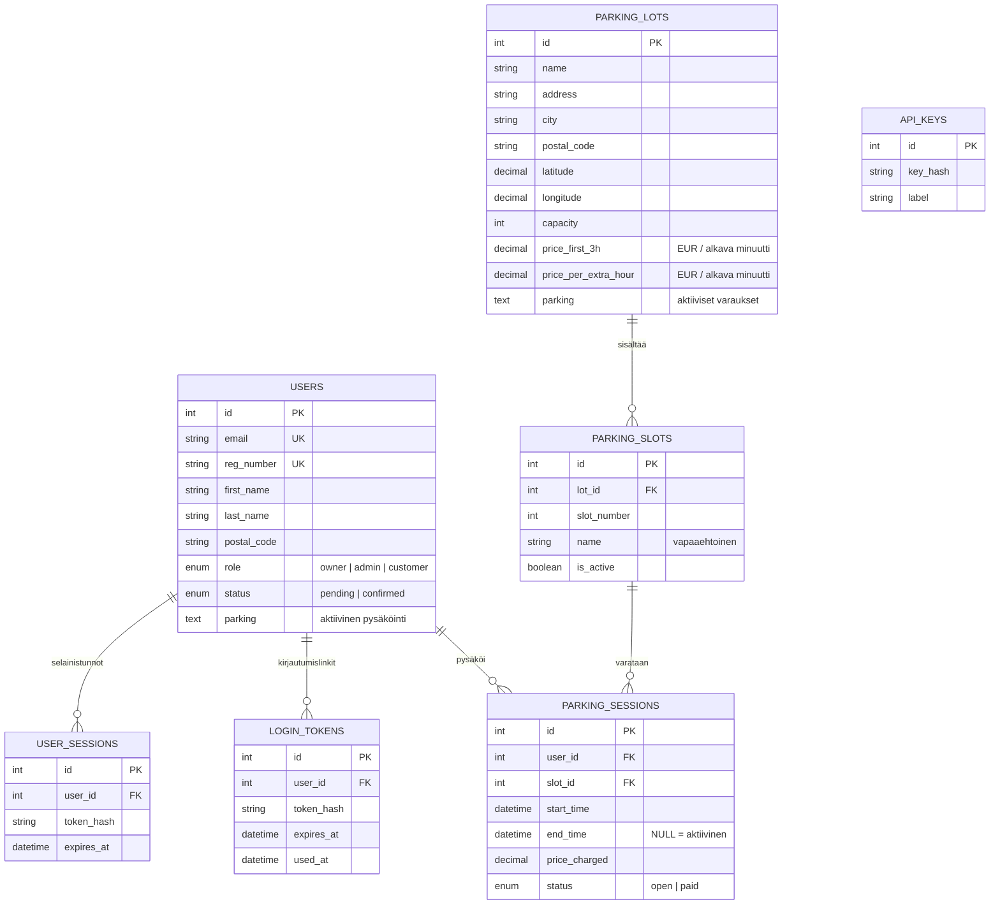

Harjoitustyönä tehty pysäköintisovellus, joka koostuu MySQL-tietokannasta, PHP:llä toteutetusta REST APIsta ja vanilla TypeScriptillä toteutetusta käyttöliittymästä, eli ei erillistä käyttöliittymäkirjastoa. Tyylit on myös perus CSS:llä väsätty. Karttana on openStreetmap. Erillistä karttakirjastoa ei käytetä vaan kartta piirretään OSM:n julkista tile-kirjastoa käyttämällä (`https://tile.openstreetmap.org/{z}/{x}/{y}.png`). Postitoimipaikkatiedot on noudettu Avoin data -palvelusta (`https://avoindata.suomi.fi/data/fi/dataset/suomen-postitoimipaikat`).

Kirjautumisessa käytetään sähköpostiin lähetettävää kirjautumislinkkiä. Selitetty tarkemmin kohdassa [Kirjautumismenetelmä](#kirjautumismenetelmä).

Lokalisointiin käytetään custom-funktiota (trans), joka käyttää .json-tiedostoja, joista luetaan käännösten lisäksi kielten nimet ja oletuskieli

Palvelu sijaitsee testipalvelimella osoitteessa: `https://testinikkari.fi/parkitin/`

## Arkkitehtuuri

Sovelluksessa on kolme pääosaa:

1. **MySQL-tietokanta** käyttäjät, pysäköintialueet, pysäköintipaikat, pysäköinnit, istunnot, kirjautumislinkit maksutiedot.
2. **PHP REST API** tietokantatoimintojen hallinta ja sähköpostin lähetys.
3. **Vanilla TypeScript + CSS** Käyttölittumätoiminnot

## Tietokanta

Tietokannan rakenne on tiedostossa `sql/schema.sql`.



`users` sisältää sekä asiakkaat että hallintakäyttäjät. Kaupunki johdetaan käyttäjän postinumerosta tiedostolla `assets/postitoimipaikat.xml`. `parking_sessions` säilyttää pysäköinti- ja laskuhistorian: aktiivisella pysäköinnillä `end_time` on `NULL`; päättynyt pysäköinti on lasku tilassa `open` tai `paid`.

`parking_lots` sisältää karttakoordinaatit, hinnat ja aktiivisten varausten tunnisteet. Alueen `capacity` muodostuu siihen liittyvien `parking_slots`-rivien määrästä. Nykyiset testihinnat ovat `0,50 EUR / alkava minuutti` ensimmäisten 180 minuutin ajan ja `0,30 EUR / alkava minuutti` sen jälkeen.

`login_tokens` ovat 15 minuutin kertakäyttöisiä sähköpostilinkkejä. `user_sessions` ovat yhden tunnin Bearer-istuntoja. `api_keys` on palvelin- ja integraatio-API:n avaimia varten.

## PHP API

APIn osoite on `/api/`. Endpoint query-parametrilla: `/parkitin/api/index.php?resource=RESOURCE`

JSON POST- ja PUT-pyynnöt lähetetään `Content-Type: application/json` -otsakkeella.

### Kirjautuminen ja käyttäjätili

- `POST resource=login_request`: vastaanottaa sähköpostin. Olemassa olevalle käyttäjälle lähetetään kirjautumislinkki. Uudelle sähköpostille palautetaan `needs_registration`.
- `POST resource=register`: luo uuden käyttäjän `pending`-tilaan ja lähettää linkin.
- `GET resource=verify&token=...`: käyttää linkin, vahvistaa käyttäjän ja palauttaa tunnin istuntotunnisteen.
- `GET resource=me`: palauttaa kirjautuneen käyttäjän tiedot ja roolin.
- `POST resource=update_profile`: muuttaa rekisterinumeroa, nimeä ja postinumeroa. Kaupunki johdetaan palvelimella.
- `DELETE resource=delete_profile`: poistaa vain nykyisen kirjautuneen käyttäjän.

### Pysäköintialueet ja paikat

- `GET resource=lots`: listaa alueet tai palauttaa yhden `id`-parametrilla.
- `POST resource=lots`: luo alueen ja sen `slots`-taulukon.
- `PUT resource=lots&id=...`: muuttaa aluetta ja paikkoja. Aktiivisia paikkoja suojataan.
- `DELETE resource=lots&id=...`: poistaa alueen.
- `GET resource=slots&lot_id=...`: listaa alueen paikat.
- `GET resource=free_slot&lot_id=...`: palauttaa ensimmäisen vapaan aktiivisen paikan.

Alueen luonti- tai päivitysdata näyttää periaatteessa tältä:

```json
{
  "name": "P-Ratina",
  "address": "Ratinankatu 2",
  "postal_code": "33100",
  "info": "Lisätiedot",
  "price_first_3h": 0.5,
  "price_per_extra_hour": 0.3,
  "slots": [
    {"name": "Sisäänkäynnin vieressä", "is_active": true},
    {"name": null, "is_active": true}
  ]
}
```

`city`, `latitude`, `longitude` ja `capacity` johdetaan tai lasketaan palvelimella. Niitä ei pidä luottaa selaimen lähettäminä arvoina.

### Pysäköinnin elinkaari

- `POST resource=parking_start`: tarkistaa, ettei käyttäjällä ole aktiivista pysäköintiä, lukitsee alueen ja vapaan paikan, luo session sekä päivittää käyttäjän ja alueen `parking`-kentät.
- `POST resource=parking_cancel`: peruu juuri tehdyn aktiivisen varauksen ja vapauttaa paikan.
- `GET resource=parking_status`: palauttaa käyttäjän aktiivisen pysäköinnin, keston ja tämänhetkisen hinnan.
- `POST resource=parking_stop`: päättää session, laskee loppuhinnan, poistaa aktiivisen tilan ja jättää session avoimeksi laskuksi.

Hinta lasketaan alkavina minuutteina. Yksi sekunti pyöristyy yhdeksi minuutiksi. Ensimmäiset 180 minuuttia käyttävät ensimmäistä hintaa ja ylimenevät minuutit jälkimmäistä hintaa.

### Maksut

- `GET resource=payments&status=open`: käyttäjän avoimet laskut.
- `GET resource=payments&status=paid`: maksu- ja pysäköintihistoria.
- `POST resource=payments_pay`: mock-maksu merkitsee kaikki käyttäjän avoimet laskut maksetuiksi.
- `GET resource=map_lots`: kirjautuneen käyttäjän karttaa varten alueet ja saatavuus.

Laskun sähköpostitoiminto on poistettu käytöstä. Maksut hallitaan tietokannan `parking_sessions.status`-kentällä.

## API-tunnistautuminen

API:ssa on kaksi tunnistautumistapaa:

1. **Kuljettaja- ja integraatio-API**: `X-Api-Key`-otsake. Protoilua varten on kovakoodattu vakio `DEV_API_KEY`;

2. **Selainkäyttöliittymä**: `Authorization: Bearer SESSION_TOKEN`. Token syntyy kertakäyttöisen sähköpostilinkin kautta ja vanhenee tunnissa.

Omistaja- ja ylläpitäjätoiminnot tarkistavat lisäksi käyttäjän roolin. Asiakkaan Bearer-token ei anna pääsyä hallintatoimintoihin.

## Käyttöliittymä

`index.php` tarjoaa vain HTML-kuoren. `src/app.ts` sisältää käyttöliittymälogiikan ja käännetään tiedostoksi `assets/js/app.js`.

UI käyttää:

- DOM API:a ilman Reactia, Vuea tai muuta UI-kirjastoa
- vanilla CSS:ää tiedostosta `assets/css/style.css`
- OpenStreetMapin tiles-apia
- selaimen geolocation-API:a käyttäjän sijainnin kysymiseen
- svg-kuvakkeita pysäköintipaikoille ja kartan keskityskuvakkeelle ja muille kuvakkeille. Ne on piirrettu Corel Draw:ssa-

Kartta käyttää tietokantaan valmiiksi tallennettuja koordinaatteja. Selaimessa ei tehdä geokoodausta osoitteista, koska siinä menee ikä ja terveys.

## Roolit

### `owner`

Ensimmäinen järjestelmään luotu käyttäjä saa automaattisesti `owner`-roolin. Omistaja voi:

- avata hallintapaneelin
- lisätä, muuttaa ja poistaa pysäköintialueita
- lisätä, muuttaa ja poistaa `admin`- ja `customer`-käyttäjiä
- nähdä owner-käyttäjät, mutta ei muuttaa tai poistaa heitä
- hallita pysäköintipaikkoja alueiden `slots`-taulukossa

### `admin`

Ylläpitäjä voi:

- avata hallintapaneelin
- hallita pysäköintialueita
- nähdä kaikki käyttäjät
- lisätä, muuttaa ja poistaa vain `customer`-käyttäjiä
- nähdä owner- ja admin-tiedot ilman muokkaus- tai poistomahdollisuutta

### `customer`

Asiakas voi:

- avata pysäköintikartan
- kysyä selaimelta oman sijainnin käyttöoikeutta
- nähdä pysäköintialueet kartalla ja niiden saatavuuden
- aloittaa yhden pysäköinnin kerrallaan
- perua juuri tehdyn varauksen
- lopettaa pysäköinnin
- avata oman profiilin
- muuttaa rekisterinumeroa, nimeä ja postinumeroa
- tarkastella avoimia maksuja ja historiaa
- käyttää mock-maksun liukusäädintä
- poistaa oman profiilinsa

Sähköpostiosoitetta ei voi muuttaa käyttöliittymästä.

## Kirjautumismenetelmä

1. Käyttäjä syöttää sähköpostiosoitteen.
2. API tarkistaa osoitteen muodon palvelimella ja selain tarkistaa sen myös normaalilla HTML-validoinnilla.
3. Olemassa oleva käyttäjä saa kertakäyttöisen kirjautumislinkin.
4. Uusi käyttäjä saa mahdollisuuden luoda `pending`-tilin.
5. Linkin avaaminen vahvistaa tilin ja luo tunnin Bearer-istunnon.
6. Puuttuvat rekisterinumero, nimi tai postinumero kysytään profiilissa.
7. Postinumero haetaan XML-rekisteristä, ja postitoimipaikka näytetään lukittuna.
8. Kartta lataa alueet ja saatavuuden.
9. Start parking lukitsee vapaan aktiivisen paikan tietokantatransaktiossa.
10. Käyttäjä vahvistaa osoitetun paikan valinnalla `I have parked` tai peruu varauksen.
11. Stop parking päättää session ja luo avoimen laskun.
12. Avoin lasku näkyy profiilin maksut-osiossa.
13. Mock-maksu merkitsee laskun `paid`-tilaan ja siirtää sen historiaan.

## Lokalisointi

Käännöstoiminnot on toteutettu ilman ulkoista kirjastoa.

`i18n/` sisältää yhden JSON-tiedoston jokaista kieli-alueyhdistelmää varten. Tiedoston rakenne on:

```json
{
  "locale": "fi-FI",
  "name": "Suomi",
  "default": true,
  "translations": {
    "login": {
      "submit": "Kirjaudu sisään"
    }
  }
}
```

`i18n/index.php` lukee kansiossa olevien JSON-tiedostojen metatiedot. Käyttöliittymän `initI18n()` valitsee sessionStorageen tallennetun kielen tai käyttää `default: true` -kieltä.

Kaikki käyttöliittymän tekstit haetaan `trans()`-funktiolla:

```typescript
trans('login.submit')
trans('welcome.greeting', { email })
```

Avain koostuu kontekstista ja tekstinimestä. Parametrit korvataan `{email}`-tyyppisillä paikoilla. Kielen vaihto ei lataa sivua uudelleen eikä tyhjennä lomakkeita. `retranslateCurrentScreen()` päivittää näkyvän näkymän tekstit, placeholderit ja painikkeet olemassa oleviin DOM-elementteihin.

## Mock-Digitraffic-data

`scripts/digitraffic-mock.json` on Digitrafficin pysäköintidatan muotoa mukaileva GeoJSON-aineisto. Se sisältää mock-kohteita suomalaisissa kaupungeissa.

## Turvallisuusperiaatteet

- Tietokantasalaisuudet ovat sovelluksen asetustiedostossa, jota ei versioida.
- Selainistunto perustuu kertakäyttöiseen, vanhenevaan Bearer-tunnisteeseen.
- Hallintatoimintojen roolit tarkistetaan PHP-palvelimella.
- Käyttäjän sähköposti validoidaan selaimessa ja palvelimella.
- Admin-rajapinnan roolit tarkistetaan palvelimella.
- Varsinaista tietosuojatarkistusta ei tälle harjoitustyölle ole tehty.

## Tiedostot

- `index.php`: selaimen HTML-kuori, header ja assettien välimuistiversiointi
- `src/app.ts`: vanilla TypeScript -käyttöliittymä, kartta, kirjautuminen ja maksut
- `assets/js/app.js`: TypeScriptin käännetty ja obfuskoitu
- `assets/css/style.css`: responsiivinen CSS
- `api/index.php`: REST-API
- `handlers/account.php`: kirjautuminen, profiili, pysäköinti ja maksut
- `handlers/users.php`: käyttäjien hallinta ja roolirajoitukset
- `handlers/lots.php`: alueiden ja paikkojen hallinta
- `handlers/slots.php`: paikkakyselyt
- `handlers/sessions.php`: pysäköintisessioiden vanhempi rajapinta
- `helpers.php`: yhteiset validointi-, JSON-, XML- ja geokoodausfunktiot
- `auth.php`: API-avain- ja session-tunnistautuminen
- `db.php`: PDO-yhteys
- `mailer.php`: PHPMailer-sähköpostit
- `sql/schema.sql`: tietokannan rakenne
- `i18n/*.json`: käyttöliittymän käännökset
- `assets/postitoimipaikat.xml`: postinumeroiden ja postitoimipaikkojen lähde
- `scripts/import_digitraffic.php`: mock-aineiston tuonti
- `scripts/expand_digitraffic_mock.php`: mock-aineiston laajennus